# AI 특징과 에이전트 활용 전략

오늘 발표 내용은 현재 AI 관련한 정보가 너무 많고 너무 빠르게 변화하고 있기 때문에 혼란스러운 상황에서, 근시일내 변하기 어려운 근본적인 AI 의 특성을 기초적인 내용부터 짚어나가면서 그런 특성을 어떻게 활용해야 할지에 대한 관점과 전략을 공유하려고 합니다.   

요약하자면 세 가지입니다.

첫 번째, 사전학습에 따른 **정적인 모델**이라는 특징과 트랜스포머라는 알고리즘으로 인한 **한정적 컨텍스트 윈도우**라는 특징이고 이를 위한 컨텍스트 최적화 전략
두 번째, 같은 입력에도 다른 결과를 내는 **비결정성**이라는 특징과 이를 이용한 랄프 전략과 RSA 전략
세 번째, 틀린 의견을 고집하는 **환각**이라는 특징과 이를 위한 멀티 에이전트 및 워크플로 전략

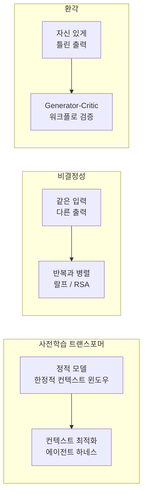

이런 순서로 각 특징과 전략에 대해서 살펴보도록 하겠습니다.
## AI 의 첫 번째 특징 - 사전학습 트랜스포머

### 사전학습 트랜스포머

GPT 는 Generative Pre-trained Transformer 의 약자입니다. 이 약어에 AI 의 한계가 드러나 있습니다.
즉 현재 AI 모델은 사전학습(Pre-trained) 모델입니다. 대기업에서 대규모 데이터와 연산을 통한 학습이 끝나면 이후로 추가적인 학습은 불가능합니다.
그리고 트랜스포머 구조는 컨텍스트 윈도우 크기라는 특징을 나타냅니다. 입력의 크기가 클수록 기하급수적인 연산력을 요구하기 때문에 입력의 크기를 제한할 수밖에 없습니다.
제 예상에 이는 앞으로 1년 내로는 극복하지 못할 중요한 개념이라 이를 짚고 넘어가는 것이 중요합니다.

이해를 쉽게 하기 위해 영화에 빗대어 설명하려고 합니다.

### 메멘토

(메멘토 포스터)

한국인이 사랑하는 감독 중 하나인 크리스토퍼 놀란 감독의 초기 영화인 메멘토가 이 AI 특징을 설명하기에 너무나도 적합한 영화입니다. 이 영화의 주인공인 레너드 쉘비가 바로 우리가 사용하고 있는 AI 라고 보면 됩니다.
레너드 쉘비는 강도사건으로 인해 뇌를 다친 사람입니다. 그로 인해 새로운 기억을 만들어내지 못하는 상태라서 매일 아침 잠에서 깨면 강도사건이 있던 즈음의 기억만 가지고 깨어납니다. 그리고 침대에서 일어나 거울 앞으로 가면 자기 몸에 기억에 없던 문신이 새겨진 것을 보고 놀랍니다.

(새미 젠킨스를 기억하라 스크린샷 첨부)

레너드 쉘비는 전직 보험 조사관입니다. 새미 젠킨스는 레너드가 멀쩡했을 당시 만난 사람입니다. 새로운 기억을 형성하지 못하는 증상으로 인해 보험금을 받았던 사람입니다. 그리고 문신을 보고 레너드는 자신이 처한 상황, 즉 새미 젠킨스처럼 기억을 형성하지 못하는 상태라는 것을 깨닫습니다.

그리고 뒤이어 작은 수첩을 발견합니다. 수첩에는 이렇게 적혀있습니다.
- 테디는 믿을만하다.
- 나탈리는 나를 동정하고 있고, 내게 도움을 준다.

그리고 폴라로이드 사진과 또 다른 문신도 발견합니다. 존G 가 내 아내를 죽였다. 그를 찾아서 복수해야 한다.

(폴라로이드, 문신, 수첩 사진)

자신이 어떤 상황인지 제대로 파악하지 못하지만 결국 레너드는 전직 보험 조사관의 능력을 가지고 테디와 나탈리를 찾아가 단서를 얻어가며 존 G 를 찾아내 복수하는 내용의 영화입니다.

레너드는 전직 보험 조사관답게 추리 능력은 뛰어납니다. 단서만 주어지면 논리적으로 추론하고, 상황을 분석하고, 행동합니다. 하지만 단서가 없으면 자기가 누구인지도, 뭘 해야 하는지도 모릅니다. **능력은 있지만 기억이 없는 것, 이것이 바로 사전학습 모델의 본질입니다.**

### 비유로 보는 AI 개념

이 영화로 AI 의 주요 개념들을 매핑해볼 수 있습니다.

**에이전트는 무엇일까요?**

문신, 폴라로이드, 사건수첩이 에이전트입니다. 즉 레너드를 다루기 위한 인터페이스죠. AI 에이전트 프로그램들은 로컬 파일을 읽고 쓰거나 제품 매뉴얼을 제공하는 등 모델이 정해진 목적을 이룰 수 있게 도움을 주는 프로그램입니다.
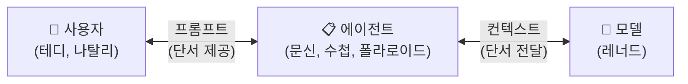

**프롬프트는 무엇일까요?**

문신, 폴라로이드, 사건수첩에 적힌 내용이 프롬프트입니다. "새미 젠킨스를 기억하라"는 문신과 "존 G 를 찾아서 복수해야 한다"는 문신은 아주 중요한 목적입니다. 너무 중요하기 때문에 몸에 새긴 것이죠. 이것은 중요도가 높은 프롬프트인 시스템 프롬프트라고 볼 수 있습니다. 그리고 단서를 추적해가면서 레너드가 테디와 나탈리로부터 받은 내용이 바로 프롬프트입니다.

**사용자는 무엇일까요?**

테디와 나탈리가 사용자입니다. 자신의 목적을 위해 레너드(AI)에게 여러 가지 단서(프롬프트)를 제공하여 목적을 이룹니다.

**컨텍스트 윈도우는 무엇일까요?**

```
/context
  ⎿  Context Usage
     ⛁ ⛀ ⛁ ⛁ ⛁ ⛁ ⛁ ⛁ ⛁ ⛁   claude-opus-4-6 · 39k/200k tokens (20%)
     ⛁ ⛁ ⛁ ⛀ ⛀ ⛁ ⛁ ⛁ ⛁ ⛁
     ⛁ ⛁ ⛶ ⛶ ⛶ ⛶ ⛶ ⛶ ⛶ ⛶   Estimated usage by category
     ⛶ ⛶ ⛶ ⛶ ⛶ ⛶ ⛶ ⛶ ⛶ ⛶   ⛁ System prompt: 3.1k tokens (1.5%)
     ⛶ ⛶ ⛶ ⛶ ⛶ ⛶ ⛶ ⛶ ⛶ ⛶   ⛁ System tools: 16.8k tokens (8.4%)
     ⛶ ⛶ ⛶ ⛶ ⛶ ⛶ ⛶ ⛶ ⛶ ⛶   ⛁ MCP tools: 5.6k tokens (2.8%)
     ⛶ ⛶ ⛶ ⛶ ⛶ ⛶ ⛶ ⛶ ⛶ ⛶   ⛁ Memory files: 408 tokens (0.2%)
     ⛶ ⛶ ⛶ ⛶ ⛶ ⛶ ⛶ ⛶ ⛶ ⛶   ⛁ Skills: 93 tokens (0.0%)
     ⛶ ⛶ ⛶ ⛝ ⛝ ⛝ ⛝ ⛝ ⛝ ⛝   ⛁ Messages: 14.9k tokens (7.4%)
     ⛝ ⛝ ⛝ ⛝ ⛝ ⛝ ⛝ ⛝ ⛝ ⛝   ⛶ Free space: 126k (63.1%)
                               ⛝ Autocompact buffer: 33k tokens (16.5%)
```

가장 중요한 개념입니다. 이건 수첩의 두께라고 할 수 있습니다. 수첩에는 간결하게 목적을 위한 정확한 단서만 있어야 레너드가 행동을 할 수 있고, 사용자가 목적을 이룰 수 있습니다.

왜 이런 제한이 있을까요? 트랜스포머의 어텐션 연산량이 토큰 수의 제곱에 비례하기 때문입니다. 길어질수록 비용이 폭증합니다. 그리고 컨텍스트가 길어지면 앞부분과 뒷부분은 기억하지만 중간 정보를 놓치는 "lost in the middle" 현상이 발생합니다. 수첩이 1000 페이지라면 레너드는 앞뒤만 기억하고 중간을 놓치게 됩니다. 모델이 정교해질수록 이 한계가 점점 완화될 수는 있겠지만, 본질적인 해결은 트랜스포머가 아닌 다른 알고리즘이 상용화되어야 가능합니다.

그리고 레너드에게는 리셋 주기가 있습니다. 일정 시간이 지나면 기억이 완전히 초기화됩니다. 만약 수첩이 너무 길어서 다 읽는 데 오래 걸린다면, 읽는 도중에 기억이 리셋되어 다시 처음부터 읽어야 하는 상황이 됩니다. AI도 마찬가지로 컨텍스트 윈도우라는 한계가 있어서, 일정 크기를 넘어가면 이전 내용을 참조할 수 없게 됩니다.

### 흔한 오해

여기서 몇 가지 질문을 떠올릴 수 있습니다.

> "사내 업무 매뉴얼을 GPT에 학습시켜서 사용하던데요?"
> "ChatGPT는 기억력이 있어서 제가 말한 것들을 오래 기억하기도 하고요. 이건 학습 아닌가요?"

하지만 이런 것들은 학습이 아닙니다. 사내 업무 매뉴얼을 채팅 프로그램(에이전트)이 들고 있다가 사용자의 프롬프트와 함께 모델에게 전달하는 것일 뿐입니다. 레너드의 수첩에 새 페이지를 추가한 것이지, 레너드의 뇌가 바뀐 게 아닙니다.

그래서 레너드의 행동을 결정하는 건 레너드 자신이 아니라 단서들입니다. 마찬가지로 **프롬프트에 뭘 어떻게 잘 적느냐가 우리가 AI를 다룰 때 할 수 있는 모든 것**입니다.

### 극복 방법의 변천사

이러한 한계를 극복하기 위한 방법은 계속 발전해왔습니다. 메멘토 비유로 설명하면 이렇습니다.

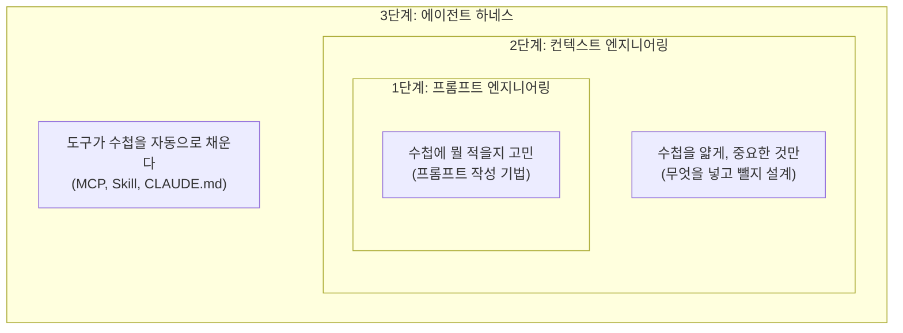

**1단계: 프롬프트 엔지니어링**

수첩에 뭘 적을지 고민하는 단계입니다. "이렇게 물어보면 더 좋은 답이 나온다", "역할을 부여하면 더 잘한다" 같은 프롬프트 작성 기법에 집중합니다.

**2단계: 컨텍스트 엔지니어링**

레너드가 읽을 수첩을 얇게 유지하고, 중요한 정보만 배치하는 단계입니다. 프롬프트 자체뿐 아니라 한정된 컨텍스트 윈도우에 무엇을 넣고 뺄지 설계합니다. 무작정 많은 단서들은 오히려 목적을 달성하는 것을 어렵게 만듭니다.

**3단계: 에이전트 하네스**

영화에서는 레너드가 직접 전화를 걸거나 사람을 찾아다니면서 단서를 수집합니다. 이처럼 사람이 직접 컨텍스트를 관리하는 게 아니라, 에이전트가 컨텍스트를 직접 구성하도록 도와주는 도구를 배치하는 것입니다. 전화나 택시 같은 것이라고 볼 수 있습니다. 에이전트 프로그램들이 MCP로 외부 도구와 연결하거나, 필요한 시점에만 로드되는 Skill을 사용하거나, 코드베이스를 자동으로 인덱싱해서 관련 파일만 컨텍스트에 넣어주는 방식입니다.

현재 3단계를 위한 많은 에이전트 프로그램들이 나오고 있습니다.

클로드 코드 또한 자체적으로 많은 하네스를 내장하고 있습니다. CLAUDE.md 파일이 그 중 하나입니다. CLAUDE.md 파일은 파일로 저장된 프롬프트로 클로드 코드가 자동으로 읽어들여 컨텍스트 윈도우에 배치합니다. CLAUDE.md 자체는 사람이 관리할 수도 있고, 자동으로 관리되도록 할 수도 있습니다. 또한 계층적 구조를 가지고 있어서 글로벌 설정이나 프로젝트 특화 설정 등을 갖게됩니다.
```
~/.claude/CLAUDE.md    # 글로벌 컨텍스트
~/project/a/CLAUDE.md  # 프로젝트 a 전용 컨텍스트
~/project/b/CLAUDE.md  # 프로젝트 b 전용 컨텍스트
```

요즘 장안의 화제인 자율 AI 비서 OpenClaw 는 자체적으로 파일을 다음과 같이 구성하여 주기적인 자동 업데이트를 통해 모델에게 자아, 작업 기억, 장기기억을 제공하는 하네스로 구성되어 있습니다.
```
~/.openclaw/workspace/ # 기본 워크스페이스 (agents.defaults.workspace로 변경 가능)
├── AGENTS.md          # 에이전트 설정
├── BOOTSTRAP.md       # 초기화 프롬프트
├── HEARTBEAT.md       # 주기적 체크 작업
├── IDENTITY.md        # 에이전트 정체성
├── MEMORY.md          # 장기 기억
├── SOUL.md            # 성격 및 태도
├── TOOLS.md           # 도구 설정
├── USER.md            # 사용자 정보
├── canvas/            # 작업 디렉토리
└── memory/            # 일일 로그 디렉토리
    ├── 2026-01-26.md
    ├── 2026-01-27.md
    └── 2026-01-28.md
```

이러한 하네스 구축을 통해 특정 목적에 맞는 에이전트 프로그램을 만드는 것이 요즘의 AI 트렌드라고 볼 수 있습니다. 제가 전하고자 하는 것은 그 바탕에는 AI 가 기억을 형성할 수 없고 컨텍스트 윈도우가 한정적이라는 한계가 있다는 것이고, 프롬프트와 컨텍스트 윈도우 자동화 하네스를 통해 잘 관리하는 것이 그 대응 전략이라는 것입니다.

저도 이러한 하네스를 모아서 ucm(Ultimate Click Machine)이라는 실험용 도구 모음을 만들어뒀습니다. ([GitHub](https://github.com/Nathan-L256/ucm))

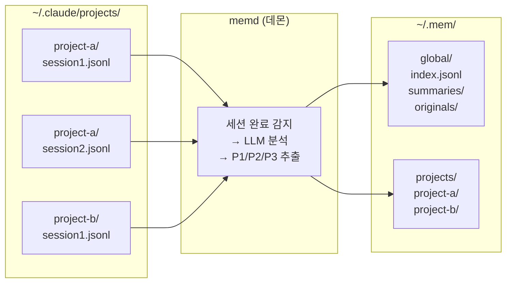

그 중  HiveMind는 기억 추출 및 인출 하네스입니다. `memd`는 데몬으로 떠서 24시간 내내 동작하면서 Claude Code의 모든 사용 로그를 읽어 재사용 가능한 기억들로 추출해서 마크다운 파일로 저장합니다. `mem`은 이 메모리를 저장하고 인출하는 CLI입니다.

그리고 mem 을 이용하는 /recall 이라는 클로드 코드 스킬을 하나 만들어두었고 이를 통해 claude code 에서 이전 작업 내역 중 필요한 것을 골라서 가져올 수 있도록 했습니다.
이 세 가지 툴을 이용하여 만들어진 하네스로 이전에 클로드 코드를 이용한 모든 작업 기억을 새로운 세션에서 컨텍스트에 포함시키는데 이용할 수 있습니다. 발표 마지막 부분에서 간단한 데모를 보여드릴 예정입니다.

## AI 의 두 번째 특징 - 비결정성
AI 는 고전적인 프로그램과 다르게 같은 입력에 대해 같은 출력을 내지 않습니다.
2+3  을 입력으로 주면 고전적 프로그램은 항상 같은 출력 5를 출력합니다.
```
fn(2+3) -> 5
fn(2+3) -> 5
fn(2+3) -> 5
fn(2+3) -> 5
...
```

AI 는 다릅니다. 출력이 비슷하긴 하지만 항상 똑같으리라 기대할 수 없습니다. AI 모델이 비결정적인 이유는 여러 층위에 걸쳐 있는데요.
temperature라는 파라미터에 따라 확률적으로 출력 토큰을 고르기 때문에 같은 질문에도 다른 답이 나옵니다.
이 temperature를 0으로 낮춰서 항상 가장 확률 높은 토큰을 고르게 하더라도, GPU 병렬 연산의 부동소수점 오차나 인프라 수준의 차이 때문에 여전히 동일한 출력을 보장할 수 없습니다.

```
ai(2+3) -> 2 더하기 3은 5입니다.
ai(2+3) -> 2 + 3 = 5입니다.
ai(2+3) -> 2 에 3을 더한 값은  5입니다.
...
```

이러한 비결정성의 세계에서는 고전적 프로그래밍에서의 방법론과 조금 다른 방법론으로 접근해야합니다.

얼마전 유행했던 유명한 랄프라는 기법을 들어보셨는지 모르겠습니다.

랄프 기법은 오픈소스 개발자 Geoffrey Huntley가 만든 AI 의 비결정성을 다루는 기초적인 방법론입니다.

바로 반복이라는 방법론입니다.

랄프 위검은 만화영화 심슨 가족에 나오는 캐릭터로 조금 멍청하지만 끈질긴 캐릭터입니다.
(랄프위검 사진)

끈질기게 반복해서 결국 성과를 내는 특성을 본따 방법론에 랄프라는 이름을 붙였다고 합니다.

기본적으로 랄프는 같은 프롬프트를 여러번 반복해서 목표 달성을 기대하는 방법론입니다.

bash 스크립트로 만들어진 간단한 툴입니다. 클로드 코드를 반복 실행하는 툴이죠. 플로우 다이어그램으로 보면 이렇습니다.
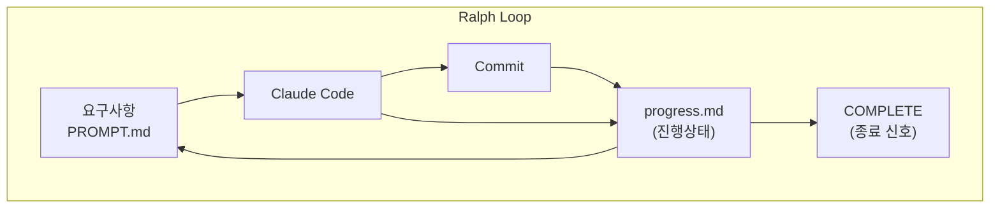

```bash
while :; do cat PROMPT.md | claude ; done
```

AI 의 비결정성 때문에 같은 프롬프트를 계속해서 반복하더라도 temperature 샘플링에 의해 매번 다른 토큰 경로를 탐색하게 됩니다. 영화 내용으로 비유하자면 레너드가 같은 단서를 보고도 다른 행동을 할 수 있다는 것입니다.

이를 반복해서 하다보면 결국 프롬프트에 적힌 목적을 완성할 수 있게 된다는 아이디어로 만들어진 방법론이고 효과가 있어서 유명해졌습니다.

하지만 여기서 만족하지 않고 조금 더 생각해볼 수 있습니다.

반복을 왜 순차적으로 반복할까요? 병렬적으로 한번에 여러 인스턴스에게 같은 프롬프트를 수행시켜도 같은 결과를 얻을 수 있습니다.

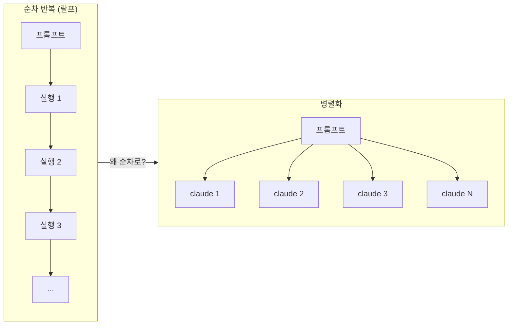

순차적으로 반복을 시키지 않아도 10개의 클로드 코드 인스턴스를 스폰하고 같은 프롬프트를 주면 10개의 클로드 코드 인스턴스는 비결정성에 의해 대부분 비슷하지만 각각 조금씩 다른 결과를 낼 수 있습니다.

여기서 한가지 더 중요한 건 git worktree입니다. 10개의 인스턴스가 같은 디렉토리에서 동시에 파일을 수정하면 충돌이 나겠죠. git worktree를 사용하면 하나의 레포지토리를 대상으로 여러 개의 작업 디렉토리를 만들 수 있습니다. 각 인스턴스가 독립된 worktree에서 작업하니까 서로 간섭 없이 병렬로 작업할 수 있고, 작업이 끝나면 각자의 결과를 취합하면 됩니다.

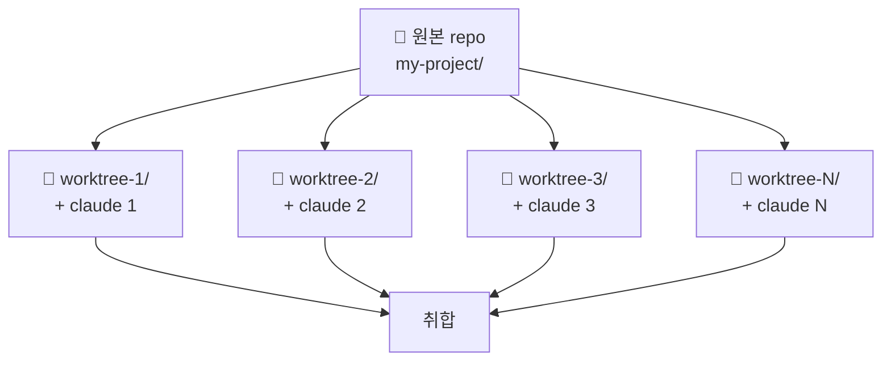

이 병렬 작업을 다시 또 반복할 수도 있겠죠. 원하는 결과가 나올때까지 말이죠

앞선 작업을 취합하여 후속 작업에서 참고하게 할 수 도 있을 겁니다.

이러한 방법론이 RSA 방법론입니다. (Recursive Self Aggregation)

단순한 반복인 랄프보다 더 빠르고 효과적인 방법이죠. 앞서 소개한 ucm의 `rsa` 가 이러한 방법론을 적용해본 툴입니다. 이것도 발표 후에 간단한 데모를 보여드리도록 하겠습니다.

다시 말하자면, AI 는 비결정성의 특징이 있고, 우리는 반복과 병렬화 기법에 의해 비결정성을 다룰 수 있게 됩니다. 하지만 비결정성을 다루는 것만으로는 충분하지 않습니다. AI 에는 세 번째 특징이 있습니다.

## AI 의 세 번째 특징 - 환각

세 번째 특징은 환각(hallucination)입니다. GPT 약어 중 생성형(Generative) 이라는 부분과 관련이 있습니다. 생성형 모델은 "모른다"고 답하기보다 확률적으로 가장 그럴듯한 것을 생성하도록 훈련되어 있어서, 틀린 내용도 자신 있게 생성합니다.
비결정성은 "같은 입력에 다른 출력이 나온다"는 것이고, 환각은 "자신 있게 틀린 출력을 낸다"는 것입니다. 다른 문제입니다.
temperature를 0으로 내려도 환각은 발생합니다. 비결정성과는 달리 사전학습 데이터를 조합하다가 현실과 맞지 않는 결과를 만들어내는 거라서요.

그래서 환각에 대응하려면 반복 뿐만 아니라 검증이 필요합니다.

### Generator-Critic 패턴

검증의 기본 패턴은 역할을 나누는 것입니다. AI 인스턴스에 프롬프트를 줄 때 역할을 부여합니다. "넌 개발자야, 요구사항에 맞는 코드를 작성해"라는 프롬프트와 "넌 코드리뷰어야, 작성된 코드가 요구사항에 맞게 작성했는지 검토해"라는 프롬프트를 주어 각각 인스턴스를 실행합니다.

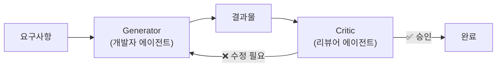

실제로 AgentCoder라는 연구에서는 프로그래머, 테스트 설계자, 테스트 실행자로 역할을 나눠서 HumanEval 벤치마크에서 96.3%의 정확도를 달성했습니다. 다만 또 다른 연구에 따르면 에이전트 간 토론 방식이 항상 단순한 방법보다 낫지는 않다는 결과도 있어서, 역할을 어떻게 설계하느냐가 중요합니다.

### 워크플로 기법

이 역할 분리 패턴을 체계화한 방법론들이 있습니다. 핵심 원칙은 **결정적 도구로 비결정적 AI 출력을 검증**하는 것입니다.

예를 들어, 프로덕션 코드를 작성하고 테스트 코드를 작성하라는 프롬프트를 줘도 AI가 100퍼센트 프로덕션 코드와 테스트 코드를 작성한다는 보장이 없습니다. 고전적 프로그래밍으로 "코드를 작성해줘"라는 프롬프트로 작업을 진행하고, 그 결과 위에 다시 고전적 프로그래밍으로 "테스트코드를 작성해줘"라는 프롬프트로 작업을 진행하면 100퍼센트 확률로 코드와 테스트코드가 작성됩니다. 이를 확장하면 더 복잡한 절차를 가진 워크플로에서도 효과적으로 동작하게 됩니다.

**PDCA (Plan-Do-Check-Act)**

품질 관리에서 나온 반복 사이클입니다. 작업을 작은 단위로 분해하고(Plan), AI가 구현하고(Do), 테스트로 검증하고(Check), 피드백을 반영합니다(Act). Check 단계에서 Generator-Critic 패턴이 적용됩니다. 그리고 이 사이클은 중첩됩니다. Plan 단계에서도 미니 PDCA가 돌고(계획 초안 → 검토 → 수정 → 확정), Design 단계에서도, Implement 단계에서도 각각 미니 PDCA가 돕니다. 각 단계에서 만족할 때까지 반복하고 다음 단계로 넘어가는 구조입니다.

연구에 따르면 PDCA를 적용한 소프트웨어는 결함이 61% 감소했고, AI 협업에서도 토큰 사용량이 10% 줄었습니다. 일반적인 방식은 완성 후 문제 해결에 80%의 토큰을 소비하는 반면, PDCA는 작은 배치로 점진적으로 검증하기 때문입니다.

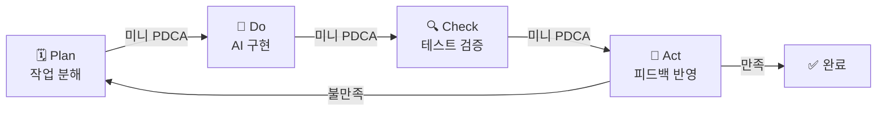

Claude Code에서 바로 쓸 수 있는 도구로 bkit이 있습니다. `/plan`, `/design`, `/implement`, `/check`, `/fix` 같은 명령어로 PDCA 사이클을 진행할 수 있습니다.
앞서 소개한 ucm에도 `qna`(설계 결정 수집) → `spec`(요구사항 생성 + 7개 기준 검증) → 실패 시 재시도하는 `req` 워크플로가 있습니다. (미완성)

**SDD (Spec Driven Development)**

명세가 소스 오브 트루스입니다. 스펙을 먼저 작성하고, AI에게 명확한 목표를 준 다음, 스펙 대비 결과를 검증합니다. 검증 단계에서 Generator-Critic 패턴이 적용됩니다. Amazon의 Kiro는 Requirements → Design → Tasks 3단계로 진행하고, GitHub의 spec-kit은 `[NEEDS CLARIFICATION]` 태그로 모호한 부분을 명시적으로 표시합니다. 바이브 코딩이 아닌 명확한 명세를 주면 복잡한 작업도 적은 반복으로 구현할 수 있습니다.

GitHub의 spec-kit은 `npm install -g @anthropic/spec-kit`으로 설치하고, `/speckit.constitution`으로 프로젝트 원칙을 정의한 뒤 `/speckit.specify` → `/speckit.plan` → `/speckit.tasks` 순서로 진행합니다.

**UCM (Ultimate Click Machine)**

해커톤을 위해 워크플로와 멀티 에이전트 기법의 개념 검증을 해봤던 프로젝트입니다. 간단한 node.js 스크립트로 설계 에이전트 → 설계 리뷰어 → 개발 에이전트 → 코드 리뷰어 → QA 에이전트로 이어지는 파이프라인을 구성하고, 각 단계에서 Generator-Critic 패턴으로 승인될 때까지 반복합니다. 해커톤 결과물인 Webhook 구현에 적용해봤는데, 요구사항 문서 하나로 설계부터 QA까지 자동으로 진행되는 걸 확인했습니다. ([GitHub](https://github.com/Nathan-L256/ucm))

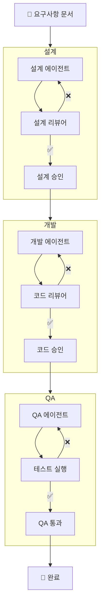
### 정리

결국 세 가지 특징에 대한 대응 전략을 정리하면 이렇습니다.
1. **기억 불가** → 자동화된 하네스를 통한 컨텍스트 윈도우 관리
2. **비결정성** → 반복과 병렬 (랄프, RSA)
3. **환각** → Generator-Critic, PDCA, SDD 등의 워크플로를 통한 검증 

이러한 기법들을 결합하면 우리가 경험했던 결과물의 품질을 훨씬 뛰어넘는 고품질의 결과물을 낼 수 있게 됩니다.

### 라스트마일 문제

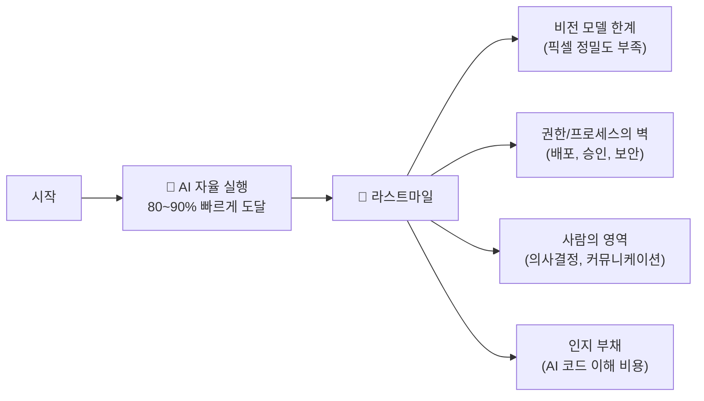

다만 라스트마일 문제는 여전히 남습니다. 라스트마일은 물류에서 나온 용어로, 배송의 마지막 구간이 가장 비용이 많이 들고 어렵다는 의미입니다. AI도 마찬가지로 80~90%까지는 빠르게 도달하지만, 나머지 10~20%가 가장 어렵고 사람의 개입이 필요합니다.

**기술적 한계 - 비전 모델**

제가 겪은 예를 들면, 프론트엔드 스타일 작업에서 AI가 "버튼이 있다"는 인식하지만 "2px 왼쪽으로 치우쳐 있다"는 감지하지 못합니다. 비전 모델은 이미지를 고정 크기 패치로 분할해서 처리하는데, 이 과정에서 픽셀 수준의 정밀도가 사라집니다. 구조적 한계라서 반복해도 해결이 안 됩니다. 이건 Chrome DevTools MCP라는 하네스로 해결했습니다. 스크린샷 대신 DOM API로 스타일 값을 텍스트로 추출하게 하니까 AI가 정확하게 검증하더라고요. 피그마 MCP 도 마찬가지입니다. JSON 형태의 파일에서 스타일을 정확하게 텍스트로 확인을 할 수 있게 해주는 하네스라고 할 수 있습니다. 다만 이러한 방법은 토큰을 많이 소모해서 스타일값을 텍스트로 확인하는 데 모든 토큰을 써서 원래의 목적에서 벗어나버리는 경우가 많습니다. 이를 해결하기 위해서는 스타일 전용 서브에이전트로 분리하는 등 추가적인 컨텍스트 윈도우 최적화가 필요합니다.

**권한과 프로세스의 벽**

또 다른 예로 배포 권한 문제가 있습니다. 인프라 관리, 프로덕션 배포 권한, 승인 프로세스, 보안 정책에 따른 승인 절차는 AI에게 권한을 주는 경우가 드뭅니다. 코드는 완성했는데 배포는 사람이 해야 하는 상황이 생깁니다. 신뢰가 쌓이면 언젠가는 AI 에게 권한을 이양할 수도 있겠지만 현재 신뢰도로는 권한 이양이 어렵습니다.

**사람의 영역**

그리고 마찬가지로 의사결정의 책임은 AI 에게 물을 수 없습니다. "이 설계가 맞는가", "이 기능을 출시해도 되는가"는 결국 사람이 판단해야 합니다. 이해관계자를 설득하는 커뮤니케이션도 마찬가지입니다. 이런 영역은 아무래도 맡기기 어렵습니다.

**어디서 최고 생산성이 나오는가**

그래서 개인용 프로젝트, 외부로 노출되지 않는 백오피스 기능, 개념 검증을 위한 프로토타이핑에서는 최고의 생산성을 낼 수 있습니다. 라스트마일이 거의 없거나 혼자 해결할 수 있는 영역이니까요. 반면 프로덕션 레벨의 출시를 위해서는 여전히 라스트마일 문제가 남아 있습니다. 하지만 앞서 말한 것처럼 AI가 발전하면서 신뢰도가 쌓이면 라스트마일이 점점 줄어들 거라는 예상은 가능합니다.

**인지 부채**

사람의 개입을 요하는 라스트마일 문제로 나타나는 또다른 문제는 인지 부채입니다. 인지 부채는 AI가 생성한 코드를 개발자가 충분히 이해하지 못한 상태로 쌓이는 부채입니다. 코드는 동작하지만 "왜 동작하는지" 모르기 때문에, 라스트마일 문제를 해결하려면 먼저 AI가 만든 코드를 이해하는 시간이 필요합니다. 이게 또 시간을 잡아먹습니다.

### 자율 실행과 대화형 협업

라스트마일 해결에 시간이 들어가기 때문에, 실제로는 자율 실행만 쓰는 게 아니라 대화형 협업과 섞어 쓰는 게 현실적입니다. 대화형 협업은 사람이 매 단계에서 판단하면서 AI와 대화하는 방식입니다. 자율 실행보다 느리지만 정확하고, 코드를 이해하면서 진행하니까 인지 부채도 덜 쌓입니다.

그럼에도 자율 실행을 강조하는 이유가 있습니다:
- **스케일링**: 대화형은 개발자 1명이 AI 1개와 작업하지만, 자율 실행은 1명이 10개를 동시에 돌릴 수 있습니다
- **AFK(자리비움)**: 밤새 돌려놓고 아침에 결과를 보는 식으로 시간 활용이 가능합니다
- **토큰 경제학**: 토큰 가격이 계속 떨어지면서 반복/병렬 실행이 인건비 대비 경제적이 되고 있습니다

라스트마일이 점점 줄어들면 결국 모니터링만 하면 되는 수준으로 수렴할 거라는 기대도 있습니다. 실무에서는 상황에 따라 대화형과 자율 실행을 적절히 선택하는 게 효과적입니다.

### 토큰 사용량

자율 실행의 단점은 바로 떠오르시겠지만 토큰 사용량입니다. 일반적으로 1회성 작업을 하는 것보다 훨씬 많은 토큰을 소모하게 됩니다.
하지만 토큰당 가격은 실제로 계속 싸지고 있으며 빅테크가 AI 컴퓨팅 인프라를 확장하는데 최선을 다하는 것을 보면 토큰 가격은 계속 떨어질 것이라는 예측을 할 수 있습니다.
그리고 앞서 이야기했던 다양한 방법론들은 클로드 코드나 코덱스같은 에이전트 툴에 내재화되고 있습니다.
서브에이전트 기능이 병렬화 전략의 초기 버전 기능이라고 할 수 있습니다. 필요한 작업을 여러 개로 나누고 서브에이전트에 필요한 컨텍스트만 전달한 다음 작업 완료를 기다립니다. 원래 세션에서는 오케스트레이션에 필요한 컨텍스트만 관리하는 등의 전략을 통해 컨텍스트 윈도우를 작은 크기로 관리할 수 있습니다.
그리고 요즘은 특히 이런 방법론 때문에 토큰 많이 쓰는 개발자가 잘하는 개발자라는 인식도 있고. 개발자들 사이에서 유행처럼 자기 토큰 사용량을 자랑하는 문화가 형성되고 있습니다.

(토큰 많이 쓴다고 자랑하는 개발자들의 유튜브 섬네일 다수 첨부)

## 결론

### 핵심 메시지

오늘 발표의 핵심은 세 가지입니다.

1. **AI는 메멘토의 레너드다** - 능력은 뛰어나지만 기억을 형성하지 못합니다. 수첩(컨텍스트)을 잘 관리하는 게 우리가 할 수 있는 모든 것입니다.

2. **비결정성은 버그가 아니라 특징이다** - 같은 입력에 다른 출력이 나오는 건 병렬화와 반복의 기회입니다. RSA처럼 N개의 다양한 답을 취합하면 혼자서는 못 낸 결과를 얻을 수 있습니다.

3. **환각은 검증으로 잡는다** - Generator-Critic 패턴으로 역할을 나누고, 결정적 도구(테스트, 린터, 스펙 등 고전 도구)로 비결정적 출력을 검증합니다.

AI 도구는 빠르게 변하지만, 오늘 다룬 세 가지 특징(사전학습과 컨텍스트 윈도우, 비결정성, 환각)은 현재 AI 의 근본 아키텍처가 유지되는 한 변하지 않습니다. 이 특징을 이해하면 새로운 도구가 나와도 "이건 어떤 특징을 보완하는 도구인가"라는 관점으로 빠르게 파악할 수 있습니다.

결국 AI를 잘 쓴다는 건 **좋은 프롬프트를 쓰는 게 아니라, AI의 한계를 이해하고 그에 맞는 하네스를 구축하는 것**입니다.

감사합니다.

---

## 데모: AI를 함수처럼 호출하여 하네스 제작하기

지금까지 AI와 대화하는 방식으로 사용해왔다면, 한 단계 더 나아가서 AI를 프로그래밍 가능한 함수처럼 다룰 수 있습니다.

```bash
# Claude Code를 서브프로세스로 호출
claude -p "이 코드를 리뷰해줘" --output-format json
```

대화가 아니라 프로그램입니다. 입력을 주고, 출력을 받고, 그 출력을 다른 프로그램의 입력으로 연결할 수 있습니다. 이렇게 하면:

- **파이프라인 구성** - 여러 AI 호출을 순차적으로 연결하거나 병렬로 실행
- **결정적 제어** - 언제 호출할지, 몇 번 호출할지, 결과를 어떻게 처리할지를 코드로 제어
- **서브에이전트보다 유연** - 내장 서브에이전트는 편리하지만, 직접 호출하면 worktree 분리, 타임아웃 설정, 재시도 로직 등을 자유롭게 구성 가능

RSA 와 HiveMind 가 바로 이 방식으로 동작합니다.

### RSA

일반적으로 에이전트 툴에 내재화된 서브에이전트나 병렬화 기능은 역할을 나눠서 서로 다른 작업을 수행하는 것에 집중되어 있습니다. "너는 설계해, 너는 구현해, 너는 테스트해."

하지만 RSA는 다릅니다. **같은 프롬프트를 N개 인스턴스에 동시에 넣습니다.** 비결정성 덕분에 각자 조금씩 다른 결과가 나오고, 이를 취합하면 혼자서는 못 낸 고품질 결과를 얻을 수도 있습니다. (아닐 수도 있습니다) 

**데모 명령어**

```bash
# Converge 데모 (조사)
echo "x402 프로토콜의 동작 원리, 지원 체인, 활용 사례, 구현 시 고려사항을 나열해줘." | rsa --project . --count 10 --rounds 2

# Diverge 데모 (설계)
echo "x402 프로토콜을 활용한 API 수익화 서비스를 설계해줘." | rsa --project . --count 10 --rounds 2
```

**취합 전략**

취합 전략은 프롬프트를 보고 자동으로 분류됩니다.

| 전략       | 방식             | 적합한 작업                       |
| -------- | -------------- | ---------------------------- |
| converge | 합집합으로 빠짐없이 수집  | 자료 조사, 코드 리뷰, 테스트 케이스, 버그 찾기 |
| diverge  | 대립점에서 상위 관점 도출 | 아키텍처 설계, 리팩토링 방안, API 설계     |

`--rounds 2`를 주면 1라운드 결과를 초안으로 2라운드 개선을 진행합니다. 문서 작성이나 마이그레이션 계획처럼 "초안 → 다각도 개선"이 필요한 작업에 유용합니다.

**Converge (수렴) 플로우**

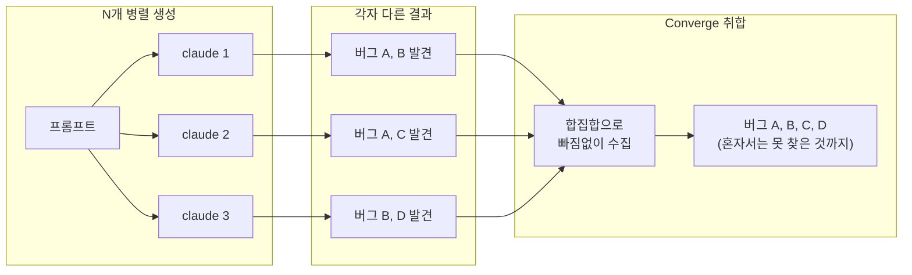

**Diverge (발산) 플로우**

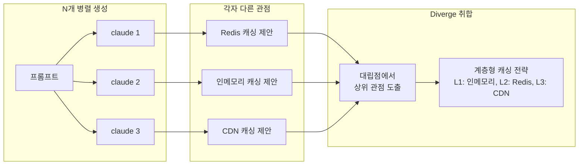

### HiveMind

앞서 RSA가 비결정성을 활용하는 도구라면, HiveMind는 첫 번째 특징인 **기억 불가**를 극복하는 도구입니다. 클로드 코드의 모든 작업 로그를 자동으로 읽고, 재사용 가능한 기억으로 추출하고, 필요할 때 인출하는 기억 시스템입니다.

에이전트 도구들은 세션이 끝나면 모든 컨텍스트가 사라집니다. 레너드가 잠들면 기억이 리셋되는 것과 같습니다. HiveMind는 레너드가 잠들기 전에 **자동으로 수첩에 중요한 내용을 적어두는 비서**라고 할 수 있습니다.

**구성 요소**

| 도구 | 역할 | 비유 |
| --- | --- | --- |
| `memd` | 데몬. 24시간 동작하며 세션 로그에서 기억 추출 | 자는 동안 수첩을 정리하는 비서 |
| `mem` | CLI. 기억 저장/검색/관리 | 수첩 |
| `/recall` | Claude Code 스킬. 세션 내에서 기억 인출 | 수첩을 펼쳐 보는 행위 |

**데모 명령어**

```bash
# 과거 작업 기억 검색
mem search "webhook-v2"

# Claude Code 세션 내에서 기억 인출
/recall lambda256-fe
```

**기억 추출 플로우**

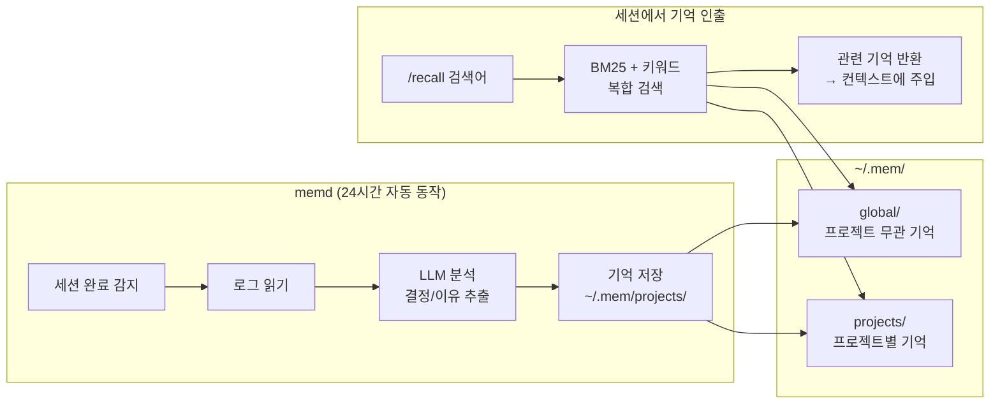

**기억의 우선순위**

추출되는 기억은 중요도에 따라 분류됩니다.

| 우선순위 | 내용 | 예시 |
| --- | --- | --- |
| P1 | 최종 결정과 그 이유 | "히스토리에 전체 메시지 구조 저장, 프론트 재구성 금지" |
| P2 | 구현 세부사항 | 변경 파일 목록, 사용한 명령어 |
| P3 | 맥락 정보 | 고려했으나 채택하지 않은 대안 |

**에빙하우스 망각 곡선 기반 감쇠**

사람의 기억처럼 오래된 기억은 점점 잊혀집니다. 하지만 자주 참조되는 기억은 강화됩니다.

```
기억 점수 = e^(-(경과시간) / (감쇠일수 × (1 + ln(1 + 참조횟수))))
```

- 참조되지 않은 기억은 약 90일 후 자동 정리
- 자주 사용되는 핵심 기억은 감쇠가 느려져 오래 유지
- 최소 10개의 기억은 점수와 무관하게 항상 유지

**실제 데모: lambda256-fe 프론트엔드 작업 기억 인출**

```
❯ /context
  ⎿  Context Usage
     ⛁ ⛀ ⛁ ⛁ ⛁ ⛁ ⛁ ⛁ ⛁ ⛁   claude-opus-4-6 · 26k/200k tokens (13%)
     ⛁ ⛁ ⛁ ⛀ ⛀ ⛀ ⛶ ⛶ ⛶ ⛶
     ⛶ ⛶ ⛶ ⛶ ⛶ ⛶ ⛶ ⛶ ⛶ ⛶   Estimated usage by category
     ⛶ ⛶ ⛶ ⛶ ⛶ ⛶ ⛶ ⛶ ⛶ ⛶   ⛁ System prompt: 3.1k tokens (1.5%)
     ⛶ ⛶ ⛶ ⛶ ⛶ ⛶ ⛶ ⛶ ⛶ ⛶   ⛁ System tools: 16.8k tokens (8.4%)
     ⛶ ⛶ ⛶ ⛶ ⛶ ⛶ ⛶ ⛶ ⛶ ⛶   ⛁ MCP tools: 5.6k tokens (2.8%)
     ⛶ ⛶ ⛶ ⛶ ⛶ ⛶ ⛶ ⛶ ⛶ ⛶   ⛁ Memory files: 408 tokens (0.2%)
     ⛶ ⛶ ⛶ ⛶ ⛶ ⛶ ⛶ ⛶ ⛶ ⛶   ⛁ Skills: 93 tokens (0.0%)
     ⛶ ⛶ ⛶ ⛝ ⛝ ⛝ ⛝ ⛝ ⛝ ⛝   ⛁ Messages: 8 tokens (0.0%)
     ⛝ ⛝ ⛝ ⛝ ⛝ ⛝ ⛝ ⛝ ⛝ ⛝   ⛶ Free space: 141k (70.5%)
                               ⛝ Autocompact buffer: 33k tokens (16.5%)
```

실제로 `/recall lambda256-fe`를 실행하면 과거에 lambda256-fe 프로젝트에서 수행한 최근 작업의 기억이 검색됩니다. 예를 들어 "Webhook V2 → Flexible/Classic 리네이밍", "ESLint 9 vs 8 충돌 시 변경 파일만 lint", "CEL Filter 에디터 모드 전환 시 프리셋 복원 버그 수정" 같은 핵심 결정사항(P1)이 새로운 세션의 컨텍스트에 주입됩니다.

```
❯ /recall lambda256-fe
⏺ 과거 세션 기억을 검색하겠습니다. 상위 5개 파일을 읽어보겠습니다.
  Read(.mem/projects/lambda256-fe/summaries/f5b7368d.md)
  ⎿  Read 175 lines
  Read(.mem/projects/lambda256-fe/summaries/99bf95fa.md)
  ⎿  Read 88 lines
  Read(.mem/projects/lambda256-fe/summaries/e6571b97.md)
  ⎿  Read 96 lines
  Read(.mem/projects/lambda256-fe/summaries/5b7edffa.md)
  ⎿  Read 69 lines
  Read(.mem/projects/lambda256-fe/summaries/ef4cdeee-topic-1.md)
  ⎿  Read 98 lines

⏺ lambda256-fe 과거 세션 기억 요약

  핵심 결정사항 (P1)

  1. Webhook V2 → Flexible/Classic 리네이밍 완료
    - 탭: V1→Classic, V2→Flexible
    - 파일명·타입·함수명 전면 리네이밍 (WebhookV2* → WebhookFlexible*)
    - API 경로 /be/v2.0/는 백엔드 버전이라 유지
  2. ESLint 9 vs 8 충돌 — 변경 파일만 lint하는 방식 사용
  3. Proxy Webhook API — /be/v3.0/proxy/webhook, DTO에 protocol, network, projectId 추가
  4. CEL Filter 에디터 — 모드 전환 시 프리셋 복원 버그 수정
  5. Receive Fields 중첩 스키마 — 재귀 함수로 교체
  6. 반응형 레이아웃 — laptop:max-w-* 반응형 prefix

  무엇을 작업하시겠습니까?

❯ /context
  ⎿  Context Usage
     ⛁ ⛀ ⛁ ⛁ ⛁ ⛁ ⛁ ⛁ ⛁ ⛁   claude-opus-4-6 · 39k/200k tokens (20%)
     ⛁ ⛁ ⛁ ⛀ ⛀ ⛁ ⛁ ⛁ ⛁ ⛁
     ⛁ ⛁ ⛶ ⛶ ⛶ ⛶ ⛶ ⛶ ⛶ ⛶   Estimated usage by category
     ⛶ ⛶ ⛶ ⛶ ⛶ ⛶ ⛶ ⛶ ⛶ ⛶   ⛁ System prompt: 3.1k tokens (1.5%)
     ⛶ ⛶ ⛶ ⛶ ⛶ ⛶ ⛶ ⛶ ⛶ ⛶   ⛁ System tools: 16.8k tokens (8.4%)
     ⛶ ⛶ ⛶ ⛶ ⛶ ⛶ ⛶ ⛶ ⛶ ⛶   ⛁ MCP tools: 5.6k tokens (2.8%)
     ⛶ ⛶ ⛶ ⛶ ⛶ ⛶ ⛶ ⛶ ⛶ ⛶   ⛁ Memory files: 408 tokens (0.2%)
     ⛶ ⛶ ⛶ ⛶ ⛶ ⛶ ⛶ ⛶ ⛶ ⛶   ⛁ Skills: 93 tokens (0.0%)
     ⛶ ⛶ ⛶ ⛝ ⛝ ⛝ ⛝ ⛝ ⛝ ⛝   ⛁ Messages: 14.9k tokens (7.4%)
     ⛝ ⛝ ⛝ ⛝ ⛝ ⛝ ⛝ ⛝ ⛝ ⛝   ⛶ Free space: 126k (63.1%)
                               ⛝ Autocompact buffer: 33k tokens (16.5%)
```


이전 세션에서 했던 작업을 새 세션에서도 이어갈 수 있게 되는 것입니다. 레너드의 수첩에 과거의 자신이 남긴 메모가 있는 것처럼요.

---
## 링크

### 연구 및 보고서
- [A Plan-Do-Check-Act Framework for AI Code Generation - InfoQ](https://www.infoq.com/articles/PDCA-AI-code-generation/) - PDCA 적용 시 토큰 10% 절감, 결함 61% 감소
- [DORA 2024 Report](https://dora.dev/research/2024/dora-report/) - AI 채택 25% 증가 시 배포 안정성 7.2% 감소
- [AgentCoder: Multi-Agent-based Code Generation](https://arxiv.org/abs/2312.13010) - 프로그래머/테스터/실행자 역할 분리로 HumanEval 96.3% 달성
- [Lost in the Middle: How Language Models Use Long Contexts](https://arxiv.org/abs/2307.03172) - 컨텍스트가 길어지면 중간 정보를 놓치는 현상

### 도구
- [Claude Code](https://docs.anthropic.com/en/docs/claude-code) - Anthropic의 AI 코딩 에이전트
- [bkit](https://github.com/popup-studio-ai/bkit-claude-code) - PDCA 사이클 Claude Code 확장
- [spec-kit](https://github.com/github/spec-kit) - GitHub의 SDD 워크플로 도구
- [Amazon Kiro](https://kiro.dev/) - Spec Driven Development IDE
- [OpenClaw](https://github.com/openclaw/openclaw) - 자율 AI 비서
- [Ralph Wiggum Technique](https://github.com/ghuntley/how-to-ralph-wiggum) - 랄프 반복 방법론

### UCM (Ultimate Click Machine)
- [UCM](https://github.com/Nathan-L256/ucm)
- [UCM 해커톤 버전](https://github.com/nodit-developers/dalbam_hackathon_2025/blob/main/Sunday_nathan_daisy/code/ucm/README.md)